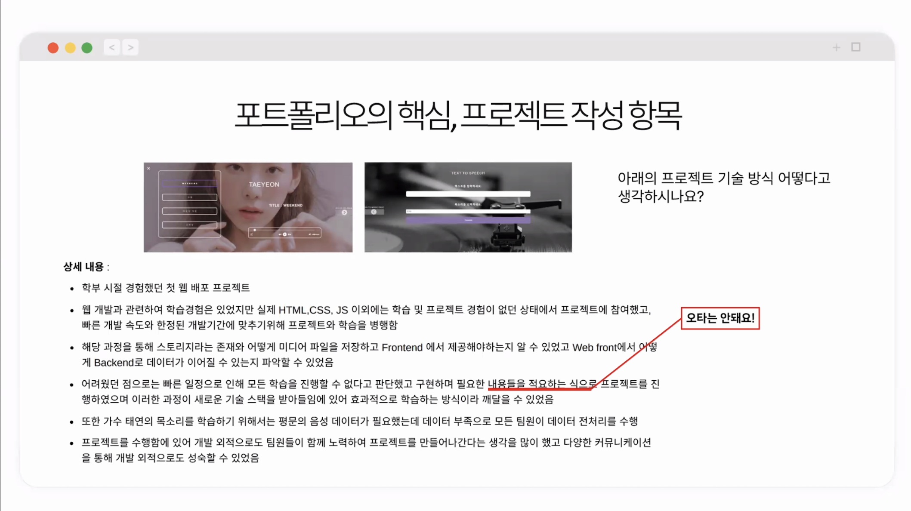

## 현재 채용 추세
공개채용 -> 수시채용
실제 직무역량의 중요성이 매우 중요해짐

## 실제 직무역량을 평가하는 방법
### BEI 면접 (행동사건면접)  
>면접자의 지난 경험을 토대로 행동했던 과정을 단계별로 자세하게 물어보며 역량을 평가하는 면접

- 왜 (그 활동을) 시작했나?
- 어떤 상황이었나?
- 어떤어떤 것이 문제들이었나?
- 문제들에 대한 해결방안을 찾기 위해 한 노력은?
- 최종적으로 당시 그 해결방안을 선택한 이유?
- 결과는 어떻게 되었나?
- 이후 자신의 행동에 대해 어떤 영향을 미쳤는가?

### 이력서는?
- 면접관에게 채용하는 직무와 자신이 얼마나 관련성이 높은지 어필하는 문서
- 면접관이 자신에게 무엇을 궁금해하고 물어보게 할지 사전에 꾸미는 조서
> 이력서 + 포트폴리오 + (블로그) + 깃허브의 얼라인이 필요

### 이력서 구성 요소: A 파트
- 3~5줄의 소개글
  - 희망 직무와 연관, 가치관과 지향점 등을 포함한 간략한 소개글 작성
  - 이력서 제목과 연결 & 어떤 개발자인지 드러낼 수 있도록
  - 클리셰 지양, 지원하는 회사와의 컬쳐핏을 함께 고려해야 함

- 사진
  - 사진의 경우 요구하는 회사의 경우 딱딱한 정장 사진보다는 인상이 좋아보이는 얼굴 사진을 사용
  - 너무 과한 사진은 탈락 요소 ex) 얼굴이 잘 안보이는 전신 사진, 바프 사진, 웃긴 사진
  - 사진은 필수 요소 x, 굳이 넣는다면을 고려

- 기술스택(스킬)
  - FE/BE/Database 또는 Language/Framework, Library/Server/Tooling, DevOps 등으로 구분하는 것도 방법!
  - 구현 가능한 범위를 경험에 기반하여 기술해주세요

### 채용공고와 이력서 내용이 비슷하면 합격률이 높을까?
합격 이력서에서 채용공고와 이력서의 내용 유사도가 높게 나타남. 경영, 비즈니스 직군에서 유사도 차이 크고, 디자인 직군에서 차이 작음

### 이력서의 구성요소: B파트
- 프로젝트 Summary: 프로젝트 제목, 개요, 주요 서비스 내용
  - 프로젝트 명만 보고서는 면접관은 어떤 서비스인지 몰라요
  - 프로젝트는 최신순으로 열거(다만, 관련성을 고려하여 유동적 적용)
  - 정통 보수 회사는 관련성 없어도 최신순 고집하는 것이 좋을 수 있음

- 프로젝트 기간, 본인의 역할, 기여도, 참여인원
  - 프로젝트 기간은 일정과 투입기간(4주, 12주 등)을 같이 기재
  - 혼자서 100%한 것인지, 팀원들과 함께 어떻게 분배했고 어떤 역할들을 맡아 했는지 면접관은 알고 싶어 한다.

- 담당업무 및 구현사항: 주요 피력사항 중심 간결하게 작성
  - 너무 자세한 것은 포트폴리오 및 블로그에 적습니다.
  - 다만 이력서에도 면접관이 관심가질 만한 요소가 있어야 포트폴리오를 열어본다.
  - 각 소개에 적재적소로 블로그나 깃허브 하이퍼링크를 연결해야 한다(매우 중요@@@@@@@@@@)

## 합격과 불합격 사이에 쓰여진 단어
### 어휘 분석

중요 단어들을 사용하기에 앞서 직접적으로 디테일하게 사용한 단어들의 Example이 존재해야 하는 것이 포인트.
반대로 fail에 해당하는 단어들은 단어 자체적으로 모호성을 띄고 있기에 면접관 입장에서 면접을 봐야 하나? 질문에도 모호한 대답이 나올 수 밖에 없다. 

## 기타

### 이력서 작성, '에이~ 설마...' 실수 Top3
1. E-Mail 주소 / 휴대전화 번호 등 연락처 정확하게 기입하기!
  - 오기재로 인해 서류 합격 연락을 받지 못하는 경우가 은근 많다. ex) 전화번호/이메일 오타, gmal, never..
  - 사소한 Tip) 당신의 E-Mail 주소(or ID)는 괜찮은지?, 별로면 새로 만들어라

2. Notion Style 이력서 작성 시, 이모지 과다 사용 지양하기!
  - 소량 사용하거나, 되도록 사용하지 말기(일부 항목 구분, 가독성을 위해 사용하는 것은 OK)
  - 너무 과하게 사용하면 시선이 주요 글이 아닌 이모지로 분산되는 역효과를 가져올 수 있음.

3. 일반적 이력서 작성 시, 항목 추가 및 삭제 가능 여부를 확인하고 실행하기
  - 기업에서 제공한 양식의 경우 '행' 추가/삭제 정도는 가능, '항목' 삭제는 주의 필요!
  - 전체 작성 완료 후, 재정렬 필수!

## 포트폴리오 작성 방법

### 포트폴리오는 어떤 항목을 중심으로 평가할까?
- 프로젝트명 
- 프로젝트 기간/내용
- 문제 해결 
- 사용언어 및 기술 스택
- 담당 역할
- 성과 및 느낀 점
- 프로젝트 내용

> => 개발 프로젝트 내 역할 수행한 부분과 팀 및 개인의 성과/성장가능성 중심 평가

### 기업이 포트폴리오를 통해 알고 싶은 주요 내용은?
1. 채용하고자 하는 직무/부서의 업무를 수행하는데 적합한 사람인지
2. 학습한 이론(사용가능한 기술/도구)을 실제로 활용할 수 있는 경험을 가지고 있는지?
3. 프로젝트 참여를 통해 기술/도구활용 역략, 문제해결 역량 등을 습득하였는지
4. 팀의 리더 또는 팔로워로서 각각 어떠한 역량을 발휘했는지?
5. 새로운 기술 역량을 빠르게 습득하여, 업무에 활용할 수 있는 능력을 갖추었는지

> 3, 4, 5번이 중요!

### 포트폴리오 꼭 작성해야 할 3가지
- 지원자로서 나를 표현하는 '슬로건'
- 성장기와 준비한 역량 '프로필'
- 프로젝트 경험과 인사이트 작성 '프로젝트'

### 포트폴리오 작성 예시
#### 슬로건 결정하기

#### 프로필 배치
- 한화

- 컬리

디자인 툴은 미리캔버스, 캔바 등 활용하기 바람

#### 프로젝트 작성 항목

상황에서 비롯된 문제와 제약조건, 문제 해결 방안을 도식화한 것을 간단하게 보여주는 것이 좋다.

위처럼 면접관은 고군분투기가 궁금한게 아니라 프로젝트를 진행하면서 어떤 문제가 있었고, 그 문제를 어떻게 해결해서 어떤 성과가 있었다는 핵심적인 것만 궁금하다. 그 직무에 관련해서 기재하고 하이퍼링크를 걸어야 한다.

### 포트폴리오 작성, '에이~ 설마...' 실수 Top3
1. 지원 기업별 각각의 파일을 만들어 관리
  - 기본 노션 페이지 / PPT 파일을 만들어 두고, 사본을 만들어 기업에 맞게 수정하는 습관 갖기!
  - 지원 기업명 오기재, 제출 파일 혼동 등 실수의 출발점이 될 수 있다.

2. '내'가 보기 좋은 X, '기업/인사담당자'가 보기 좋은 템플릿 선택
  - 이모지 사용과 동일, 시선을 뺏기지 않도록 항목의 배치 및 내용을 명료하게
  - 기업 이미지, CI(로고) 등에 맞추어 템플릿 색상을 수정한다면 긍정적 Point 획득

3. 오탈자 검수 제발, 개발 도구/기술 등에 대한 명칭은 한글 쓰기 지양
  - 자기소개서와 달리, 포트폴리오는 오탈자 확인을 하지 않는 경우가 많다.
  - 줄임말은 변수명/컬럼명에만 고민하자, 한글로 쓴 포트폴리오인만큼, 알파벳(키워드)은 이목을 집중시키는 효과가 있다.